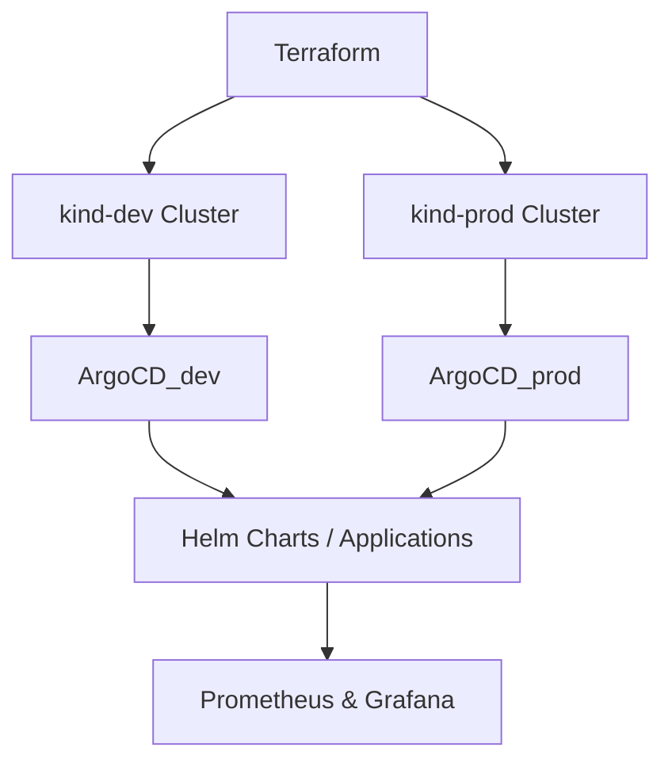

## 🏗️ System Architecture



**Legend & Flow Description**
1. **Terraform** provisions two local Kubernetes clusters (`kind-dev` and `kind-prod`).
2. In each cluster, **Argo CD** is deployed and configured as a GitOps controller.
3. **ArgoCD_dev** and **ArgoCD_prod** synchronize Helm applications from the Git repository.
4. Applications are packaged using **Helm Charts** with environment-specific `values_dev.yaml` and `values_prod.yaml`.
5. **Prometheus & Grafana** provide centralized monitoring and visualization for both environments.

*Data and configuration flow:*
Git → Argo CD → Kubernetes → Prometheus/Grafana


# Step 1 – Specifications & Organization
## Project: **Argo CD on two kind clusters (dev & prod) via Terraform + Prometheus/Grafana**

---

### 🧩 Context
This project is part of the **DevOps & Cloud Architecture Training Program (DataScientest)**.
It demonstrates the deployment of a **multi-environment GitOps architecture** using **Terraform, Kubernetes (kind), Argo CD, Helm, and Prometheus/Grafana**.
The environment simulates a real-world setup with two clusters (**dev** and **prod**) managed entirely through code.

---

### 🎯 Objectives
- Automate provisioning of **two Kubernetes clusters** (`kind-dev`, `kind-prod`) with Terraform.
- Deploy **Argo CD** in each cluster to manage applications declaratively via GitOps.
- Apply the **App-of-Apps pattern** for multi-app orchestration.
- Separate configuration per environment with `values_dev.yaml` and `values_prod.yaml`.
- Integrate **Prometheus and Grafana** for observability.
- Enforce **“Everything as Code”** – IaC, CaC, PaC.
- Prepare a base architecture ready for migration to AWS EKS or another cloud.

---

### 🧭 Scope
| In Scope | Out of Scope |
|-----------|--------------|
| Two local kind clusters (dev & prod) | Public cloud deployment |
| Argo CD + GitOps management | Vault / external secrets |
| Terraform provisioning + Helm apps | Ingress controller / DNS |
| Prometheus + Grafana monitoring | Front-end UI testing |
| Namespace segregation & RBAC | Advanced network policies |

---

### 👥 Functional Requirements
| Role | Requirement |
|-------|-------------|
| **DevOps Engineer** | Create and manage clusters via Terraform |
| **Developers** | Continuous delivery through Git commits → Argo CD sync |
| **Operators / SRE** | Monitor apps and clusters via Prometheus & Grafana |
| **System** | Keep desired and actual states synchronized |

---

### ⚙️ Non-Functional Requirements
| Category | Description |
|-----------|-------------|
| **Availability** | Argo CD auto-reconciles apps in both clusters |
| **Scalability** | Easily extendable to additional clusters or cloud |
| **Security** | Namespace isolation, RBAC, HTTPS for Dashboards |
| **Observability** | Centralized metrics & dashboards |
| **Maintainability** | All infra/configs as code in Git |
| **Performance** | Optimized for local setup (16–24 GB RAM WSL2) |

---

### 🧱 Architecture Components
| Component | Description |
|------------|-------------|
| **Terraform** | Provisions two kind clusters (dev & prod) |
| **Kubernetes (kind)** | Local K8s runtime for testing multi-env deployments |
| **Argo CD** | GitOps controller for automated sync |
| **Helm** | Package manager for K8s apps with per-env values |
| **Prometheus & Grafana** | Monitoring and visualization stack |
| **GitHub** | SCM and collaboration platform |
| **Docker / WSL2** | Container runtime for local execution |

---

### 🧰 Solution Stack
```yaml
Cloud Provider: Local (Docker Desktop + kind)
IaC: Terraform
CaC: Helm
PaC: Argo CD (App-of-Apps pattern)
CI/CD: Argo CD Sync + GitHub Actions (planned)
Monitoring: Prometheus + Grafana
Version Control: GitHub
Runtime: Kubernetes v1.29 (kind)
```

### Repository Structure
```
│
├── HelmCharts             # All Helm Charts
│   ├── ChartTest1
│   │   ├── Chart.yaml
│   │   ├── templates
│   │   ├── values_dev.yaml    # DEV Values
│   │   ├── values_prod.yaml   # PROD Values
│   │   └── values.yaml        # Default Values
│   └── ChartTest2
│       ├── Chart.yaml
│       ├── templates
│       ├── values_dev.yaml    # DEV Values
│       ├── values_prod.yaml   # PROD Values
│       └── values.yaml        # Default Values
│
├── dev                        # Cluster name
│   ├── applications
│   │   ├── app1.yaml
│   │   └── app2.yaml
│   └── root.yaml              # Root ArgoCD Application
└── prod                       # Cluster name
    ├── applications
    │   ├── app1.yaml
    │   └── app2.yaml
    └── root.yaml              # Root ArgoCD Application
```


###  CI/CD and Git Flow

| Stage    | Tool                     | Description                                |
| -------- | ------------------------ | ------------------------------------------ |
| **CI**   | GitHub Actions (Planned) | Validate Terraform & Helm templates        |
| **CD**   | Argo CD                  | Auto-sync manifests from Git to clusters   |
| **Flow** | GitHub Flow              | `main` = prod / `dev` = development branch |

### Monitoring & Observability

- Prometheus collects cluster and app metrics
- Grafana visualizes data through dashboards
- Future integration with Alertmanager for alerting

### Security
- Namespace-level isolation (argocd-dev, argocd-prod)
- HTTPS via self-signed cert or Ingress TLS
- Role-based access control for Kubernetes resources

### Continuity & Recovery
- Terraform recreates clusters and Argo CD setup from scratch
- Argo CD restores application state from Git (desired = actual)
- Future: backup Grafana dashboards and Prometheus data volumes

### Deliverables – Step 1

| Deliverable                     | Description                               |
| ------------------------------- | ----------------------------------------- |
| `docs/specifications.md`        | Context, scope, objectives, requirements  |
| `docs/architecture_diagram.png` | System and flow diagram                   |
| `terraform/`                    | IaC for kind clusters                     |
| `dev/`, `prod/`                 | Argo CD Root Apps and applications        |
| `HelmCharts/`                   | Helm charts with per-environment values   |
| GitHub Project Board            | Issues / milestones for progress tracking |
